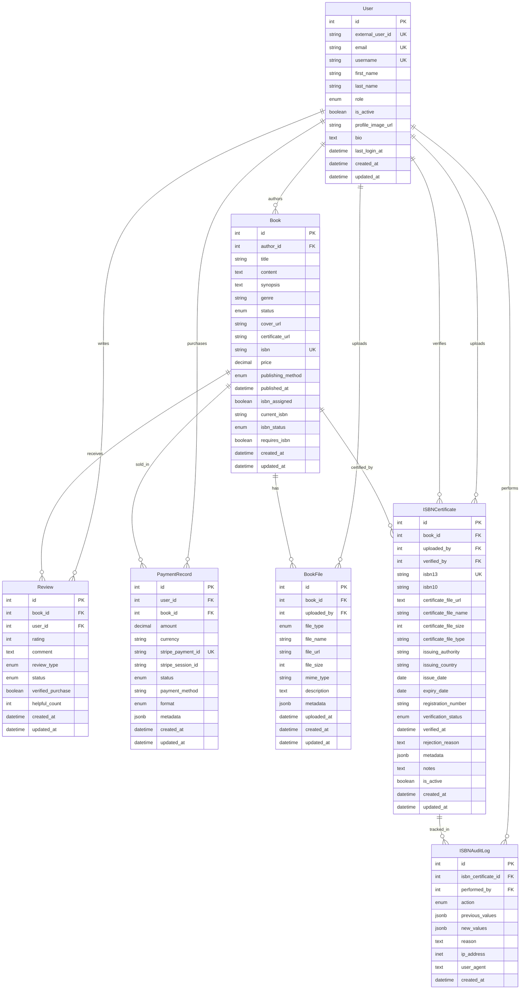

# 📊 Book Service Database Documentation

## 🎯 Overview

The Book Service database is designed to support a comprehensive publishing platform that manages the complete lifecycle of digital and traditional book publishing. Built with PostgreSQL and Sequelize ORM, it provides robust data management for authors, publishers, reviewers, and readers.

## 🏗️ Database Architecture

### Technology Stack

- **Database**: PostgreSQL 13+
- **ORM**: Sequelize 6.37.7
- **Node.js**: 22.15.0
- **Migration Tool**: Sequelize CLI

### Design Principles

- **Normalized Schema**: Reduces data redundancy
- **Foreign Key Constraints**: Ensures data integrity
- **Comprehensive Indexing**: Optimized for performance
- **Audit Trail**: Complete tracking of sensitive operations
- **Flexible Publishing**: Supports multiple publishing methods

## 📋 Entity Relationship Diagram



## 📚 Table Definitions

### 👤 Users Table

**Purpose**: Central user management for all platform participants

| Column              | Type     | Constraints                 | Description                   |
| ------------------- | -------- | --------------------------- | ----------------------------- |
| `id`                | INTEGER  | PK, AUTO_INCREMENT          | Primary identifier            |
| `external_user_id`  | STRING   | NOT NULL, UNIQUE            | Integration with auth service |
| `email`             | STRING   | NOT NULL, UNIQUE            | User email address            |
| `username`          | STRING   | NOT NULL, UNIQUE            | Unique username               |
| `first_name`        | STRING   | NULLABLE                    | User's first name             |
| `last_name`         | STRING   | NULLABLE                    | User's last name              |
| `role`              | ENUM     | NOT NULL, DEFAULT: 'READER' | User role in system           |
| `is_active`         | BOOLEAN  | NOT NULL, DEFAULT: true     | Account status                |
| `profile_image_url` | STRING   | NULLABLE                    | Profile picture URL           |
| `bio`               | TEXT     | NULLABLE                    | User biography                |
| `last_login_at`     | DATETIME | NULLABLE                    | Last login timestamp          |

**Roles**: `AUTHOR`, `REVIEWER`, `ADMIN`, `READER`, `PUBLISHER`

### 📖 Books Table

**Purpose**: Core book content and metadata management

| Column              | Type          | Constraints              | Description            |
| ------------------- | ------------- | ------------------------ | ---------------------- |
| `id`                | INTEGER       | PK, AUTO_INCREMENT       | Primary identifier     |
| `author_id`         | INTEGER       | FK → users.id            | Book author reference  |
| `title`             | STRING        | NOT NULL                 | Book title             |
| `content`           | TEXT          | NULLABLE                 | Main book content      |
| `synopsis`          | TEXT          | NULLABLE                 | Book description       |
| `genre`             | STRING        | NULLABLE                 | Book genre/category    |
| `status`            | ENUM          | DEFAULT: 'DRAFT'         | Publishing status      |
| `cover_url`         | STRING        | NULLABLE                 | Cover image URL        |
| `isbn`              | STRING        | UNIQUE, NULLABLE         | ISBN number            |
| `price`             | DECIMAL(10,2) | NULLABLE                 | Book price             |
| `publishing_method` | ENUM          | DEFAULT: 'DIGITAL'       | Publication method     |
| `isbn_assigned`     | BOOLEAN       | DEFAULT: false           | ISBN assignment status |
| `current_isbn`      | STRING(17)    | NULLABLE                 | Active ISBN            |
| `isbn_status`       | ENUM          | DEFAULT: 'NOT_REQUESTED' | ISBN process status    |
| `requires_isbn`     | BOOLEAN       | DEFAULT: true            | ISBN requirement flag  |

**Status Values**: `DRAFT`, `UNDER_REVIEW`, `APPROVED`, `PUBLISHED`, `REJECTED`
**Publishing Methods**: `TRADITIONAL`, `SELF_PUBLISH`, `DIGITAL`
**ISBN Status**: `NOT_REQUESTED`, `REQUESTED`, `ASSIGNED`, `VERIFIED`, `PUBLISHED`

### 📁 Book Files Table

**Purpose**: File management for covers, certificates, and documents

| Column        | Type    | Constraints        | Description              |
| ------------- | ------- | ------------------ | ------------------------ |
| `id`          | INTEGER | PK, AUTO_INCREMENT | Primary identifier       |
| `book_id`     | INTEGER | FK → books.id      | Associated book          |
| `uploaded_by` | INTEGER | FK → users.id      | File uploader            |
| `file_type`   | ENUM    | NOT NULL           | Type of file             |
| `file_url`    | STRING  | NOT NULL           | S3 storage URL           |
| `file_size`   | INTEGER | NULLABLE           | File size in bytes       |
| `mime_type`   | STRING  | NULLABLE           | File MIME type           |
| `metadata`    | JSONB   | DEFAULT: {}        | Additional file metadata |

**File Types**: `COVER`, `ISBN_CERTIFICATE`, `ADDITIONAL_DOC`

### ⭐ Reviews Table

**Purpose**: Review and rating system for books

| Column              | Type    | Constraints        | Description           |
| ------------------- | ------- | ------------------ | --------------------- |
| `id`                | INTEGER | PK, AUTO_INCREMENT | Primary identifier    |
| `book_id`           | INTEGER | FK → books.id      | Reviewed book         |
| `user_id`           | INTEGER | FK → users.id      | Reviewer              |
| `rating`            | INTEGER | NOT NULL, 1-5      | Star rating           |
| `comment`           | TEXT    | NULLABLE           | Review text           |
| `review_type`       | ENUM    | DEFAULT: 'READER'  | Type of review        |
| `verified_purchase` | BOOLEAN | DEFAULT: false     | Purchase verification |
| `helpful_count`     | INTEGER | DEFAULT: 0         | Helpfulness votes     |

**Review Types**: `EDITORIAL`, `READER`, `PROFESSIONAL`
**Review Status**: `PENDING`, `APPROVED`, `REJECTED`

### 💳 Payment Records Table

**Purpose**: Transaction tracking and order management

| Column              | Type          | Constraints        | Description             |
| ------------------- | ------------- | ------------------ | ----------------------- |
| `id`                | INTEGER       | PK, AUTO_INCREMENT | Primary identifier      |
| `user_id`           | INTEGER       | FK → users.id      | Purchaser               |
| `book_id`           | INTEGER       | FK → books.id      | Purchased book          |
| `amount`            | DECIMAL(10,2) | NOT NULL           | Payment amount          |
| `stripe_payment_id` | STRING        | UNIQUE, NOT NULL   | Stripe transaction ID   |
| `status`            | ENUM          | DEFAULT: 'PENDING' | Payment status          |
| `format`            | ENUM          | DEFAULT: 'DIGITAL' | Purchase format         |
| `metadata`          | JSONB         | DEFAULT: {}        | Additional payment data |

**Payment Status**: `PENDING`, `COMPLETED`, `FAILED`, `REFUNDED`
**Format Options**: `DIGITAL`, `PRINT`, `BOTH`

### 📄 ISBN Certificates Table

**Purpose**: ISBN certificate management and verification

| Column                 | Type       | Constraints        | Description               |
| ---------------------- | ---------- | ------------------ | ------------------------- |
| `id`                   | INTEGER    | PK, AUTO_INCREMENT | Primary identifier        |
| `book_id`              | INTEGER    | FK → books.id      | Associated book           |
| `uploaded_by`          | INTEGER    | FK → users.id      | Certificate uploader      |
| `verified_by`          | INTEGER    | FK → users.id      | Verifying admin           |
| `isbn13`               | STRING(17) | UNIQUE, NOT NULL   | ISBN-13 number            |
| `isbn10`               | STRING(13) | NULLABLE           | Legacy ISBN-10            |
| `certificate_file_url` | TEXT       | NOT NULL           | Certificate file URL      |
| `issuing_authority`    | STRING     | NOT NULL           | ISBN issuing organization |
| `issuing_country`      | STRING(3)  | NOT NULL           | Country code              |
| `verification_status`  | ENUM       | DEFAULT: 'PENDING' | Verification state        |
| `is_active`            | BOOLEAN    | DEFAULT: true      | Certificate status        |

**Verification Status**: `PENDING`, `VERIFIED`, `REJECTED`, `EXPIRED`

### 📝 ISBN Audit Logs Table

**Purpose**: Complete audit trail for ISBN operations

| Column                | Type    | Constraints               | Description           |
| --------------------- | ------- | ------------------------- | --------------------- |
| `id`                  | INTEGER | PK, AUTO_INCREMENT        | Primary identifier    |
| `isbn_certificate_id` | INTEGER | FK → isbn_certificates.id | Certificate reference |
| `performed_by`        | INTEGER | FK → users.id             | Action performer      |
| `action`              | ENUM    | NOT NULL                  | Action type           |
| `previous_values`     | JSONB   | DEFAULT: {}               | Previous state        |
| `new_values`          | JSONB   | DEFAULT: {}               | New state             |
| `ip_address`          | INET    | NULLABLE                  | Source IP address     |
| `user_agent`          | TEXT    | NULLABLE                  | Client information    |

**Action Types**: `CREATED`, `UPDATED`, `VERIFIED`, `REJECTED`, `EXPIRED`, `REACTIVATED`, `DEACTIVATED`

## 🔗 Relationships Summary

### User-Centric Relationships

- **👤 User → Book (1:N)**: Authors can create multiple books
- **👤 User → Review (1:N)**: Users can write multiple reviews
- **👤 User → PaymentRecord (1:N)**: Users can purchase multiple books
- **👤 User → BookFile (1:N)**: Users can upload multiple files
- **👤 User → ISBNCertificate (1:N)**: Users can upload/verify certificates
- **👤 User → ISBNAuditLog (1:N)**: Users perform audited actions

### Book-Centric Relationships

- **📖 Book → BookFile (1:N)**: Books can have multiple files
- **📖 Book → Review (1:N)**: Books can receive multiple reviews
- **📖 Book → PaymentRecord (1:N)**: Books can have multiple purchases
- **📖 Book → ISBNCertificate (1:N)**: Books can have multiple ISBN certificates

### ISBN Certificate Relationships

- **📄 ISBNCertificate → ISBNAuditLog (1:N)**: Each certificate has audit trail

## 📊 Database Indexes

### Performance Optimization

```sql
-- User indexes
CREATE INDEX idx_users_external_user_id ON users(external_user_id);
CREATE INDEX idx_users_email ON users(email);
CREATE INDEX idx_users_role ON users(role);

-- Book indexes
CREATE INDEX idx_books_author_id ON books(author_id);
CREATE INDEX idx_books_status ON books(status);
CREATE INDEX idx_books_genre ON books(genre);
CREATE INDEX idx_books_isbn_status ON books(isbn_status);

-- Review indexes
CREATE INDEX idx_reviews_book_id ON reviews(book_id);
CREATE INDEX idx_reviews_user_id ON reviews(user_id);
CREATE INDEX idx_reviews_rating ON reviews(rating);

-- Payment indexes
CREATE INDEX idx_payment_records_user_id ON payment_records(user_id);
CREATE INDEX idx_payment_records_book_id ON payment_records(book_id);
CREATE INDEX idx_payment_records_status ON payment_records(status);

-- ISBN Certificate indexes
CREATE INDEX idx_isbn_certificates_book_id ON isbn_certificates(book_id);
CREATE INDEX idx_isbn_certificates_verification_status ON isbn_certificates(verification_status);

-- Audit Log indexes
CREATE INDEX idx_isbn_audit_logs_certificate_id ON isbn_audit_logs(isbn_certificate_id);
CREATE INDEX idx_isbn_audit_logs_performed_by ON isbn_audit_logs(performed_by);
```

## 🛠️ Setup Instructions

### Prerequisites

```bash
# Required software
- Node.js 16+
- PostgreSQL 13+
- npm or yarn package manager
```

### Database Setup

```bash
# 1. Create databases
createdb book_service
createdb book_service_test

# 2. Install dependencies
npm install sequelize sequelize-cli pg pg-hstore

# 3. Set environment variables
# Copy .env.example to .env and configure:
DB_HOST=localhost
DB_PORT=5432
DB_NAME=book_service
DB_USER=postgres
DB_PASSWORD=yourpassword

# 4. Run migrations
npx sequelize-cli db:migrate

# 5. (Optional) Run seeders
npx sequelize-cli db:seed:all
```

### Migration Commands

```bash
# Check migration status
npx sequelize-cli db:migrate:status

# Run pending migrations
npx sequelize-cli db:migrate

# Rollback last migration
npx sequelize-cli db:migrate:undo

# Rollback all migrations
npx sequelize-cli db:migrate:undo:all

# Create new migration
npx sequelize-cli migration:generate --name migration-name
```

## 🔍 Query Examples

### Common Operations

#### User Management

```javascript
// Find user with authored books
const userWithBooks = await User.findByPk(userId, {
  include: [
    {
      model: Book,
      as: "authored_books",
      include: ["files", "reviews"],
    },
  ],
});

// Get user's purchase history
const userPurchases = await PaymentRecord.findAll({
  where: { user_id: userId, status: "COMPLETED" },
  include: [
    {
      model: Book,
      as: "book",
      include: ["author"],
    },
  ],
});
```

#### Book Operations

```javascript
// Get book with all related data
const bookWithDetails = await Book.findByPk(bookId, {
  include: [
    { model: User, as: "author" },
    { model: BookFile, as: "files" },
    { model: Review, as: "reviews" },
    { model: ISBNCertificate, as: "isbn_certificates" },
  ],
});

// Get books by status with pagination
const publishedBooks = await Book.findAndCountAll({
  where: { status: "PUBLISHED" },
  include: [{ model: User, as: "author" }],
  limit: 20,
  offset: page * 20,
  order: [["published_at", "DESC"]],
});
```

#### ISBN Management

```javascript
// Get certificates requiring verification
const pendingCertificates = await ISBNCertificate.findAll({
  where: { verification_status: "PENDING" },
  include: [
    { model: Book, as: "book" },
    { model: User, as: "uploader" },
  ],
});

// Get audit trail for certificate
const auditTrail = await ISBNAuditLog.findAll({
  where: { isbn_certificate_id: certificateId },
  include: [{ model: User, as: "performer" }],
  order: [["created_at", "DESC"]],
});
```

## 📈 Performance Considerations

### Query Optimization

- Use appropriate indexes for frequent queries
- Implement pagination for large result sets
- Use eager loading judiciously to avoid N+1 problems
- Consider database connection pooling

### Scaling Strategies

- Read replicas for query distribution
- Partitioning for large tables (audit logs)
- Caching frequently accessed data
- Archive old audit logs periodically

## 🔒 Security Features

### Data Protection

- Foreign key constraints maintain referential integrity
- Input validation at model level
- Audit trail for sensitive operations
- Soft deletes for data recovery

### Access Control

- Role-based permissions in User model
- Owner-based access for books and files
- Admin-only operations for ISBN verification
- Audit logging for accountability

## 🧪 Testing

### Model Testing

```javascript
// Test model relationships
const db = require("./src/data-access/sequelize/models");

// Verify all models loaded
console.log("Available models:", Object.keys(db));

// Test associations
const user = await db.User.create({
  external_user_id: "test-123",
  email: "test@example.com",
  username: "testuser",
  role: "AUTHOR",
});

const book = await user.createAuthored_book({
  title: "Test Book",
  content: "Test content",
  status: "DRAFT",
});
```

## 📚 References

- [Sequelize Documentation](https://sequelize.org/docs/v6/)
- [PostgreSQL Documentation](https://www.postgresql.org/docs/)
- [Database Design Best Practices](https://www.vertabelo.com/blog/database-design-best-practices/)

---

**Last Updated**: January 2025  
**Database Version**: 1.0  
**Sequelize Version**: 6.37.7
