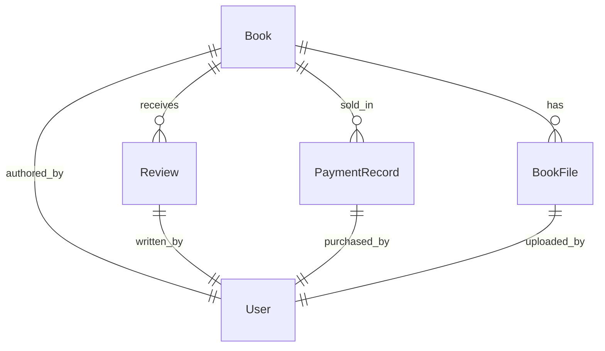

# 📊 Sequelize Documentation - Book Service

## Table of Contents

1. [Setup and Configuration](#setup-and-configuration)
2. [Database Models](#database-models)
3. [Migrations](#migrations)
4. [Commands Reference](#commands-reference)
5. [Best Practices](#best-practices)
6. [Troubleshooting](#troubleshooting)

## 🚀 Setup and Configuration

### Initial Setup

```bash
# Create database
createdb bookservice_dev
createdb bookservice_test

# Install dependencies
npm install sequelize sequelize-cli pg pg-hstore

# Run migrations
npx sequelize-cli db:migrate

# Run seeders (if any)
npx sequelize-cli db:seed:all

# 1. Drop database and start fresh with correct naming
npx sequelize-cli db:drop
npx sequelize-cli db:create

# 2. Remove any inconsistent migration files
rm -f /home/ifham/Rag\ Release/Dev/rag-release-be/book-service/src/data-access/sequelize/migrations/*Users*
rm -f /home/ifham/Rag\ Release/Dev/rag-release-be/book-service/src/data-access/sequelize/migrations/*BookFiles*

# 3. Run migrations in correct order
npx sequelize-cli db:migrate

# 4. Test models
node -e "
const db = require('./src/data-access/sequelize/models');
console.log('Models loaded:', Object.keys(db));
console.log('✅ All fixed!');
"
```

### Environment Variables

```env
# Database Configuration
DB_HOST=localhost
DB_PORT=5432
DB_NAME=bookservice_dev
DB_USER=postgres
DB_PASSWORD=yourpassword

# Test Database
DB_TEST_NAME=bookservice_test
```

## 📋 Database Models

### Book Model

- **Table:** `books`
- **Primary Key:** `id`
- **Key Features:**
  - Text content storage
  - File URL references
  - Publishing workflow states
  - ISBN management

### BookFile Model

- **Table:** `book_files`
- **Primary Key:** `id`
- **Purpose:** Store file metadata for covers and certificates
- **File Types:** COVER, ISBN_CERTIFICATE, ADDITIONAL_DOC

### Review Model

- **Table:** `reviews`
- **Primary Key:** `id`
- **Types:** EDITORIAL, READER, PROFESSIONAL
- **Features:** Rating system, verified purchases

### PaymentRecord Model

- **Table:** `payment_records`
- **Primary Key:** `id`
- **Integration:** Stripe payment processing
- **Statuses:** PENDING, COMPLETED, FAILED, REFUNDED

## 🔄 Migrations

### Available Migrations

1. **20250301000000-create-books.js**
   - Creates main books table
   - Adds indexes for performance

2. **20250302000000-create-book-files.js**
   - Creates file storage table
   - Supports multiple file types

3. **20250303000000-create-reviews.js**
   - Creates review system
   - Supports editorial and reader reviews

4. **20250304000000-create-payment-records.js**
   - Creates payment tracking
   - Stripe integration ready

### Creating New Migrations

```bash
# Generate new migration
npx sequelize-cli migration:generate --name add-new-feature

# Example: Add column to books table
npx sequelize-cli migration:generate --name add-language-to-books
```

## 📋 Commands Reference

### Database Operations

```bash
# Create database
npx sequelize-cli db:create

# Drop database
npx sequelize-cli db:drop

# Run all pending migrations
npx sequelize-cli db:migrate

# Undo last migration
npx sequelize-cli db:migrate:undo

# Undo all migrations
npx sequelize-cli db:migrate:undo:all

# Run specific migration
npx sequelize-cli db:migrate --to 20250301000000-create-books.js
```

### Model Operations

```bash
# Generate new model with migration
npx sequelize-cli model:generate --name BookCategory --attributes name:string,description:text

# Generate model without migration
npx sequelize-cli model:generate --name BookTag --attributes name:string --no-migration
```

### Seeder Operations

```bash
# Generate seeder
npx sequelize-cli seed:generate --name demo-books

# Run all seeders
npx sequelize-cli db:seed:all

# Run specific seeder
npx sequelize-cli db:seed --seed 20250301000000-demo-books.js

# Undo last seeder
npx sequelize-cli db:seed:undo

# Undo all seeders
npx sequelize-cli db:seed:undo:all
```

### Environment-Specific Commands

```bash
# Run migrations for test environment
NODE_ENV=test npx sequelize-cli db:migrate

# Run migrations for production
NODE_ENV=production npx sequelize-cli db:migrate
```

## 🛠️ Best Practices

### Migration Best Practices

1. **Always backup before migrations in production**
2. **Test migrations in development first**
3. **Use descriptive migration names**
4. **Include both up and down methods**
5. **Add indexes for frequently queried columns**

### Model Best Practices

1. **Use proper validations**
2. **Define associations clearly**
3. **Add instance and class methods for business logic**
4. **Use hooks for data transformation**
5. **Implement proper JSON serialization**

### Performance Optimization

```javascript
// Add indexes in migrations
await queryInterface.addIndex("books", ["author_id", "status"]);

// Use eager loading for associations
const books = await Book.findAll({
  include: [
    { model: BookFile, as: "files" },
    { model: Review, as: "reviews" },
  ],
});

// Use pagination for large datasets
const books = await Book.findAndCountAll({
  limit: 20,
  offset: page * 20,
  order: [["created_at", "DESC"]],
});
```

## 🔧 Troubleshooting

### Common Issues

#### 1. Config file not found

```bash
ERROR: Cannot find config file
```

**Solution:** Ensure `.sequelizerc` file exists and points to correct config path.

#### 2. Database connection refused

```bash
ERROR: Connection refused
```

**Solution:** Check database credentials and ensure PostgreSQL is running.

#### 3. Migration already exists

```bash
ERROR: Migration already exists
```

**Solution:** Check existing migrations or use `db:migrate:status` to see current state.

#### 4. Permission denied

```bash
ERROR: Permission denied for database
```

**Solution:** Ensure database user has proper permissions.

### Useful Debug Commands

```bash
# Check migration status
npx sequelize-cli db:migrate:status

# Validate models
node -e "require('./src/data-access/sequelize/models').sequelize.authenticate()"

# Test database connection
npx sequelize-cli db:create --dry-run
```

### Environment-Specific Issues

#### Development

- Ensure PostgreSQL is running locally
- Check `.env` file for correct credentials
- Verify database exists

#### Test

- Use separate test database
- Clear data between tests
- Use transactions for test isolation

#### Production

- Use SSL connections
- Enable connection pooling
- Monitor query performance
- Regular backup procedures

## 📊 Model Relationships



## 🔍 Query Examples

### Complex Queries

```javascript
// Get books with average ratings
const booksWithRatings = await Book.findAll({
  include: [
    {
      model: Review,
      as: "reviews",
      attributes: [],
    },
  ],
  attributes: [
    "id",
    "title",
    "price",
    [sequelize.fn("AVG", sequelize.col("reviews.rating")), "avgRating"],
    [sequelize.fn("COUNT", sequelize.col("reviews.id")), "reviewCount"],
  ],
  group: ["Book.id"],
  having: sequelize.where(
    sequelize.fn("COUNT", sequelize.col("reviews.id")),
    ">",
    0
  ),
});

// Get user's purchased books
const userBooks = await PaymentRecord.findAll({
  where: {
    user_id: userId,
    status: "COMPLETED",
  },
  include: [
    {
      model: Book,
      as: "book",
      include: [
        {
          model: BookFile,
          as: "files",
          where: { file_type: "COVER" },
          required: false,
        },
      ],
    },
  ],
});
```

This documentation provides comprehensive guidance for working with Sequelize in the Book Service project.
