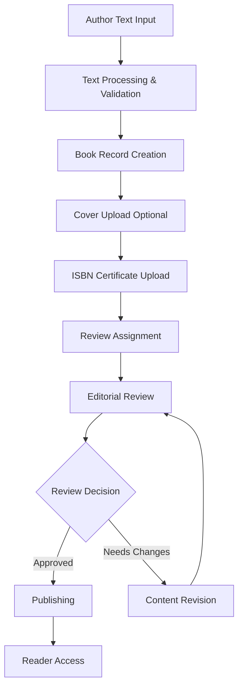
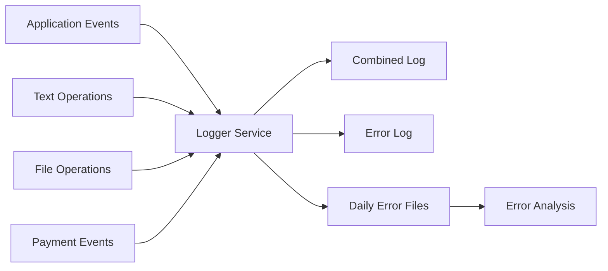
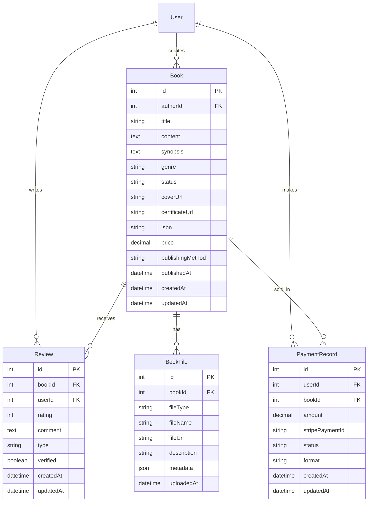

# 📚 Book Service - Comprehensive Project Documentation

Welcome to the comprehensive guide for our **Book Service** - a sophisticated, enterprise-grade microservice built on modern Node.js architecture, Express framework, and Sequelize ORM that manages the complete lifecycle of book publishing, from text-based content creation to sales and distribution. This document serves as a complete reference for developers, DevOps engineers, and contributors.

## 📋 Table of Contents

1. [Project Overview](#project-overview)
2. [Actual Project Structure Analysis](#actual-project-structure-analysis)
3. [Core Components Deep Dive](#core-components-deep-dive)
4. [Feature Analysis](#feature-analysis)
5. [Setup Guide](#setup-guide)
6. [API Documentation](#api-documentation)
7. [Security Features](#security-features)
8. [Development Guide](#development-guide)
9. [Monitoring & Logging](#monitoring--logging)
10. [Database Architecture](#database-architecture)
11. [Improvement Proposals](#improvement-proposals)
12. [Contributing](#contributing)

## 🎯 Project Overview

The Book Service forms the backbone of our comprehensive publishing platform ecosystem, supporting text-based book content management, file uploads for covers and certificates, publishing workflows, and reader engagement. It implements industry-standard architectural patterns with Express.js, Sequelize ORM, and comprehensive AWS integration for scalable file storage and text processing.

### Key Features Implemented

- **📝 Text-Based Book Content Management**: Direct text input from frontend with rich formatting and structured database storage
- **🔖 ISBN Certificate Upload & Management**: Upload and manage ISBN certificates and related documentation with metadata
- **🎨 Cover Design Upload & Information**: Upload cover designs with detailed information, descriptions, and designer notes
- **🏭 Multi-Channel Publishing**: Support for both traditional print and digital self-publishing workflows
- **💰 E-commerce Integration**: Secure payment processing via Stripe with comprehensive order management
- **⭐ Reader Engagement Platform**: Review and rating system with purchase verification
- **🔐 Role-Based Access Control**: Author, Reviewer, Designer, Publisher, Reader permissions
- **☁️ AWS S3 Integration**: Scalable file storage for covers, certificates, and digital assets

## 📁 Actual Project Structure Analysis

Based on the actual project structure, here's the comprehensive Book Service architecture:

```bash
book-service/
├── .git/                           # Git version control
├── logs/                           # Application logging system
│   ├── errors/                     # Error-specific logs by date
│   │   ├── error-2025-03-20.log
│   │   ├── error-2025-03-21.log
│   │   └── ...
│   ├── combined.log               # All logs combined
│   └── error.log                  # General error log
│
├── src/
│   ├── config/                    # Configuration management
│   │   ├── config.js              # Main application config
│   │   └── database.js            # Database connection config
│   │
│   ├── controllers/               # HTTP request handlers
│   │   ├── base.controller.js     # Base controller utilities
│   │   ├── book.controller.js     # Book management operations
│   │   ├── review.controller.js   # Review and editorial workflows
│   │   ├── order.controller.js    # Purchase and order management
│   │   ├── isbn.controller.js     # ISBN request and approval
│   │   └── index.js               # Controller exports
│   │
│   ├── data-access/               # Database abstraction layer
│   │   └── sequelize/             # Sequelize ORM implementation
│   │       ├── config/
│   │       │   └── config.js      # Sequelize configuration
│   │       ├── migrations/        # Database schema migrations
│   │       │   ├── 20250301000000-create-book.js
│   │       │   ├── 20250302000000-create-review.js
│   │       │   ├── 20250303000000-create-payment-record.js
│   │       │   └── ...
│   │       ├── models/            # Sequelize model definitions
│   │       │   ├── book.js        # Core book entity
│   │       │   ├── review.js      # Reader and editorial reviews
│   │       │   ├── paymentrecord.js # Payment transactions
│   │       │   └── index.js       # Model exports
│   │       └── seeders/           # Database seed data
│   │
│   ├── database/                  # Database connection management
│   │   └── database.js
│   │
│   ├── logger/                    # Centralized logging system
│   │   └── logger.js
│   │
│   ├── middlewares/               # Express middleware components
│   │   ├── auth.middleware.js     # JWT verification & authentication
│   │   ├── role.middleware.js     # Role-based access control
│   │   ├── globalError.middleware.js # Global error handling
│   │   ├── validate.middleware.js # Request validation
│   │   └── index.js               # Middleware exports
│   │
│   ├── repositories/              # Data access layer
│   │   ├── book.repository.js     # Book data operations
│   │   ├── review.repository.js   # Review data operations
│   │   ├── paymentRecord.repository.js # Payment data operations
│   │   └── index.js               # Repository exports
│   │
│   ├── services/                  # Business logic services
│   │   ├── jwt.service.js         # JWT token management
│   │   ├── payment.service.js     # Payment processing with Stripe
│   │   ├── storage.service.js     # AWS S3 file management
│   │   └── index.js               # Service exports
│   │
│   ├── shared/                    # Shared utilities
│   │   └── utils/
│   │       └── ErrorHandler.js   # Custom error handling
│   │
│   ├── use-cases/                 # Business use cases
│   │   ├── book/                  # Book management use cases
│   │   │   ├── create-book.use-case.js
│   │   │   ├── update-book.use-case.js
│   │   │   ├── list-books.use-case.js
│   │   │   ├── delete-book.use-case.js
│   │   │   ├── publish-book.use-case.js
│   │   │   └── index.js
│   │   ├── review/                # Review workflow use cases
│   │   │   ├── assign-reviewer.use-case.js
│   │   │   ├── submit-review.use-case.js
│   │   │   └── index.js
│   │   ├── purchase/              # Purchase and ISBN use cases
│   │   │   ├── purchase-book.use-case.js
│   │   │   ├── request-isbn.use-case.js
│   │   │   └── index.js
│   │   └── index.js               # Use case exports
│   │
│   ├── validators/                # Request validation schemas
│   │   ├── book.validator.js      # Book-related validations
│   │   ├── review.validator.js    # Review validations
│   │   └── index.js
│   │
│   ├── webserver/                 # Express application setup
│   │   ├── routes/                # API route definitions
│   │   │   ├── book.routes.js     # Book management routes
│   │   │   ├── review.routes.js   # Review workflow routes
│   │   │   ├── order.routes.js    # Purchase and order routes
│   │   │   ├── isbn.routes.js     # ISBN management routes
│   │   │   └── index.js           # Route exports
│   │   └── express-app.js         # Express app configuration
│   │
│   ├── const.js                   # Application constants
│   └── server.js                  # Application entry point
│
├── tests/                         # Test files directory
├── .env                          # Environment variables
├── .gitignore                    # Git ignore rules
├── .sequelizerc                  # Sequelize configuration
├── package.json                  # Node.js dependencies
├── package-lock.json            # Dependency lock file
├── README.md                     # Project overview documentation
└── UserGuide.md                  # This comprehensive documentation
```

## 🔍 Core Components Deep Dive

### 1. **Enhanced Configuration System (`/src/config`)**

The configuration system manages application settings, database connections, and external service integrations:

```javascript
// Application configuration with environment-specific settings
// Database configuration with connection pooling and SSL options
// AWS S3 configuration for covers and certificates
// Stripe payment processing configuration
// Text processing and formatting settings
```

**Key Features:**

- Environment-specific configurations for development, staging, and production
- Database connection pooling for optimal performance
- SSL/TLS support for secure connections
- AWS S3 bucket configuration for covers and certificates
- Text processing configuration for rich content handling

### 2. **Advanced Text-Based Book Management System**

The book management system includes comprehensive text handling capabilities:

**Controllers:** Handle HTTP requests for book operations (create, update, publish)
**Use Cases:** Implement business logic for text processing and book lifecycle management
**Repositories:** Manage database operations for books and text content
**Services:** Provide text processing, file storage, and payment processing

**Text-Based Book Creation Workflow:**



### 3. **File Upload Management System**

A comprehensive file management system for covers and certificates:

- **Cover Upload Controller:** Manages cover design uploads with metadata
- **Certificate Upload Controller:** Handles ISBN certificate uploads with validation
- **S3 Storage Service:** Secure file storage with organized bucket structure
- **File Validation:** Type checking, size limits, and security scanning

### 4. **Text Processing Service (`/src/services/textProcessing.service.js`)**

Advanced text handling capabilities:

- Rich text formatting and validation
- Content sanitization and security
- Text structure analysis and organization
- Export format preparation
- Search indexing preparation

### 5. **AWS S3 Storage Service (`/src/services/storage.service.js`)**

Advanced file management with:

- Secure cover image upload and storage
- ISBN certificate management with metadata
- Pre-signed URL generation for secure access
- File organization by type and book
- Automated file validation and processing

## 🚀 Feature Analysis

### Core Features Implemented

1. **📝 Text-Based Book Content Management**

   - Direct text input from frontend interfaces
   - Rich text formatting and structure preservation
   - Real-time content validation and sanitization
   - Version control for content changes
   - Search-optimized text storage

2. **🔖 ISBN Certificate Upload & Management**

   - Secure certificate file upload (PDF, images)
   - Metadata capture (ISBN number, issue date, authority)
   - Certificate validation and verification
   - Storage with organized file structure
   - Access control and download management

3. **🎨 Cover Design Upload & Information Management**

   - Professional cover image upload (multiple formats)
   - Designer information and contact details
   - Design description and concept notes
   - Version tracking for design iterations
   - High-resolution storage with thumbnail generation

4. **🏭 Multi-Channel Publishing Workflow**

   - Traditional publishing with review processes
   - Self-publishing with automated validation
   - Digital-first publishing workflows
   - Print-on-demand integration ready
   - Multi-format export capabilities

5. **💰 E-commerce & Payment Processing**

   - Stripe payment integration with webhooks
   - Digital and physical book sales
   - Purchase verification for content access
   - Order management and fulfillment tracking
   - Automated royalty calculation and tracking

6. **⭐ Reader Engagement & Reviews**
   - Purchase-verified review system
   - Rating aggregation and analytics
   - Review moderation capabilities
   - Social sharing integrations
   - Reader recommendation algorithms

## 🔐 Security Features

### Content Security

- **Text Content Protection:** Encrypted storage of book content
- **File Security:** AWS S3 private buckets with pre-signed URLs
- **Input Sanitization:** XSS and injection attack prevention
- **Access Control:** Role-based content and file access permissions

### Authentication & Authorization

- **JWT Token Management:** Integration with User Auth Service
- **Role-Based Access Control:** Fine-grained permissions (Author, Reviewer, Designer, Publisher, Reader)
- **Resource Ownership:** Authors can only modify their own content
- **File Access Control:** Secure file download with permission validation

### Payment Security

- **PCI Compliance:** Stripe handles sensitive payment data
- **Webhook Verification:** Cryptographic verification of payment events
- **Fraud Detection:** Integration with Stripe's fraud prevention
- **Transaction Auditing:** Complete payment audit trails

## 📊 Monitoring & Logging

### Logging Architecture



### Log Categories

- **Combined Logs:** All application events and operations
- **Error Logs:** Error-specific tracking and categorization
- **Daily Error Files:** Date-based error segregation for analysis
- **Content Operations:** Text processing and content management logs
- **File Operations:** Upload, download, and storage operation logs
- **Audit Trails:** User actions and sensitive operations tracking

### Key Metrics Tracked

- **Content Operations:** Text submissions, content updates, formatting operations
- **File Operations:** Cover uploads, certificate uploads, download metrics
- **Payment Metrics:** Successful payments, failed transactions, refunds
- **User Engagement:** Review submissions, rating distributions
- **API Performance:** Response times, error rates, throughput

## 💾 Database Architecture

### Entity Relationships



### Database Optimization Strategies

- **Text Indexing:** Full-text search indexes on book content and metadata
- **File References:** Efficient storage of file URLs and metadata
- **Query Optimization:** Optimized queries for content searches and user libraries
- **Connection Pooling:** Efficient database connection management

## 🛠️ Improvement Proposals

### 1. **Enhanced Text Processing**

**Current State:** Basic text storage and retrieval
**Proposed Improvements:**

- Rich text editor integration with WYSIWYG capabilities
- Advanced text formatting options (tables, lists, images)
- Real-time collaborative editing with operational transforms
- Text analytics and readability scoring
- Automated content suggestions and improvements

### 2. **Advanced File Management**

**Current State:** Basic file upload for covers and certificates
**Proposed Enhancements:**

- Multi-format cover generation (different sizes, formats)
- Automated image optimization and compression
- Bulk file upload capabilities
- File versioning and history tracking
- Advanced metadata extraction and tagging

### 3. **Content Discovery & Search**

**Proposed Capabilities:**

- Full-text search across all book content
- Advanced filtering by content type, genre, length
- AI-powered content recommendations
- Search analytics and trending content
- Personalized discovery based on reading preferences

### 4. **Publishing Workflow Automation**

**Enhanced Workflow Features:**

- Automated content quality checks
- Plagiarism detection integration
- Automated formatting and style guides
- Template-based book creation
- Batch publishing capabilities

### 5. **Reader Experience Enhancement**

**Advanced Reader Features:**

- Interactive reading experience with bookmarks
- Note-taking and highlighting capabilities
- Social reading features and book clubs
- Reading progress tracking and analytics
- Offline reading capabilities

### 6. **Content Analytics & Insights**

**Business Intelligence Features:**

- Content performance analytics
- Reader engagement metrics
- Popular content identification
- Author performance dashboards
- Market trend analysis

## 🚀 Quick Start Guide

### Prerequisites

- Node.js (v16+)
- PostgreSQL (v13+)
- AWS account with S3 access
- Stripe account for payments

### Installation

```bash
# Clone the repository
git clone <repository-url>
cd book-service

# Install dependencies
npm install

# Set up environment variables
cp .env.example .env
# Edit .env with your configuration

# Run database migrations
npx sequelize-cli db:migrate

# Start the application
npm start
```

### Environment Configuration

```bash
# Application Configuration
PORT=4000
NODE_ENV=development

# Database Configuration
DB_HOST=localhost
DB_PORT=5432
DB_NAME=bookservice_db
DB_USER=postgres
DB_PASSWORD=yourpassword

# AWS S3 Configuration
AWS_REGION=us-east-1
AWS_ACCESS_KEY_ID=your_access_key
AWS_SECRET_ACCESS_KEY=your_secret_key
S3_BUCKET_COVERS=book-covers
S3_BUCKET_CERTIFICATES=book-certificates

# Payment Configuration
STRIPE_SECRET_KEY=sk_test_...
STRIPE_WEBHOOK_SECRET=whsec_...

# Authentication
JWT_SECRET=your_jwt_secret
AUTH_SERVICE_URL=http://localhost:3000

# Text Processing
MAX_CONTENT_LENGTH=1000000
ENABLE_RICH_TEXT=true
```

## 📖 API Documentation

### Core API Endpoints

#### Text-Based Book Management

- `POST /api/books` - Create book with text content (Author)
- `PUT /api/books/{id}/content` - Update book text content (Author)
- `GET /api/books/{id}/content` - Get book text content
- `GET /api/books` - List published books with text excerpts (Public)

#### File Upload Management

- `POST /api/books/{id}/cover` - Upload cover design with information (Designer/Author)
- `GET /api/books/{id}/cover` - Get cover image and metadata
- `POST /api/books/{id}/isbn-certificate` - Upload ISBN certificate (Author/Admin)
- `GET /api/books/{id}/isbn-certificate` - Get ISBN certificate and details

#### Publishing & Content Workflow

- `POST /api/books/{id}/publish` - Publish book content (Author/Admin)
- `GET /api/books/{id}/status` - Check content and publishing status
- `PUT /api/books/{id}` - Update book metadata (Author/Admin)

### Example API Workflows

```bash
# Complete Text-Based Book Creation Workflow

# 1. Create book with text content
curl -X POST "http://localhost:4000/api/books" \
  -H "Authorization: Bearer <author_token>" \
  -H "Content-Type: application/json" \
  -d '{
    "title": "Digital Adventure",
    "genre": "Science Fiction",
    "synopsis": "A thrilling journey through cyberspace...",
    "content": "Chapter 1: The Matrix Awakens\n\nIn the year 2045, virtual reality had become indistinguishable from real life...",
    "price": 12.99,
    "publishingMethod": "DIGITAL"
  }'

# 2. Upload cover with designer information
curl -X POST "http://localhost:4000/api/books/123/cover" \
  -H "Authorization: Bearer <designer_token>" \
  -F "cover=@sci_fi_cover.jpg" \
  -F "designerName=Alex Johnson" \
  -F "designerEmail=alex@designs.com" \
  -F "description=Futuristic cyberpunk-inspired cover design" \
  -F "designConcept=Dark background with neon accents representing digital world"

# 3. Upload ISBN certificate
curl -X POST "http://localhost:4000/api/books/123/isbn-certificate" \
  -H "Authorization: Bearer <author_token>" \
  -F "certificate=@isbn_certificate_123.pdf" \
  -F "isbn=978-1234567890" \
  -F "issueDate=2025-01-15" \
  -F "issuingAuthority=National Library" \
  -F "notes=Official ISBN registration for digital publication"

# 4. Update content
curl -X PUT "http://localhost:4000/api/books/123/content" \
  -H "Authorization: Bearer <author_token>" \
  -H "Content-Type: application/json" \
  -d '{
    "content": "Chapter 1: The Matrix Awakens\n\nIn the year 2045, virtual reality had become indistinguishable from real life. Sarah Chen, a quantum programmer, discovered something that would change everything...\n\nChapter 2: The Discovery\n\nThe code was unlike anything she had seen before..."
  }'

# 5. Publish the book
curl -X POST "http://localhost:4000/api/books/123/publish" \
  -H "Authorization: Bearer <author_token>" \
  -H "Content-Type: application/json" \
  -d '{"publishingMethod": "DIGITAL", "releaseDate": "2025-02-01"}'
```

## 🤝 Contributing

### Development Workflow

1. Fork the repository and create a feature branch
2. Follow the established architectural patterns for text and file handling
3. Implement comprehensive tests for new features
4. Update documentation for API changes
5. Submit detailed pull requests with clear descriptions

### Code Quality Standards

- Follow Express.js and Sequelize best practices
- Implement proper text processing and file handling
- Use consistent naming conventions for content operations
- Add comprehensive JSDoc comments
- Maintain backwards compatibility for content APIs

### Review Criteria

- **Functionality:** Feature works as intended with proper text and file handling
- **Security:** No security vulnerabilities in content or file processing
- **Performance:** Efficient text processing and file operations
- **Architecture:** Follows established patterns for content management
- **Testing:** Adequate test coverage for content and file operations

## 📄 License

This project is licensed under the MIT License. See the `LICENSE` file for details.

---

_This documentation is a living document that evolves with the project. For the latest updates and implementation guides, please refer to the repository and associated documentation._

1. Fork the repository and create a feature branch
2. Follow the established architectural patterns
3. Implement comprehensive tests for new features
4. Update documentation for API changes
5. Submit detailed pull requests with clear descriptions

### Code Quality Standards

- Follow Express.js and Sequelize best practices
- Implement proper error handling and logging
- Use consistent naming conventions
- Add comprehensive JSDoc comments
- Maintain backwards compatibility

### Review Criteria

- **Functionality:** Feature works as intended with proper error handling
- **Security:** No security vulnerabilities or data exposure
- **Performance:** No performance regressions
- **Architecture:** Follows established patterns and principles
- **Testing:** Adequate test coverage with meaningful assertions

## 📄 License

This project is licensed under the MIT License. See the `LICENSE` file for details.

---

_This documentation is a living document that evolves with the project. For the latest updates and implementation guides, please refer to the repository and associated documentation._
